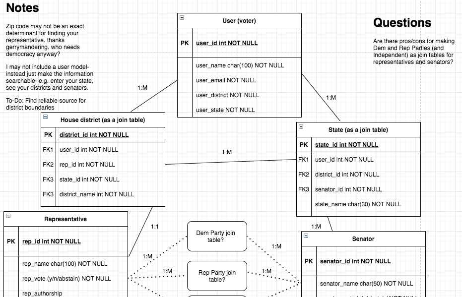
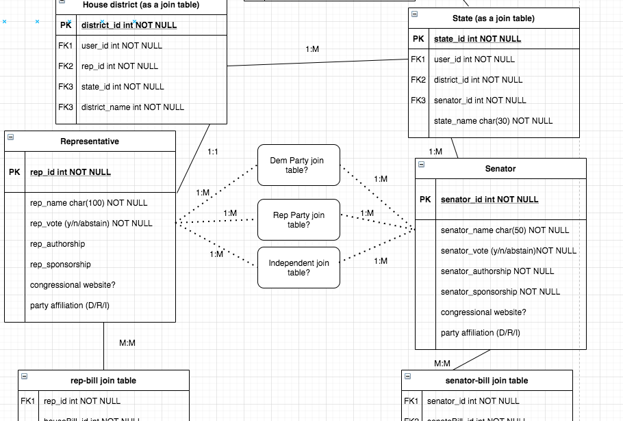
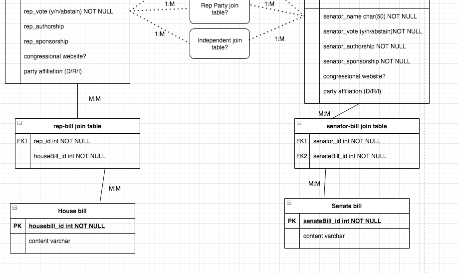
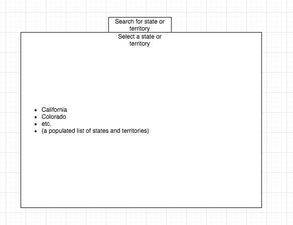
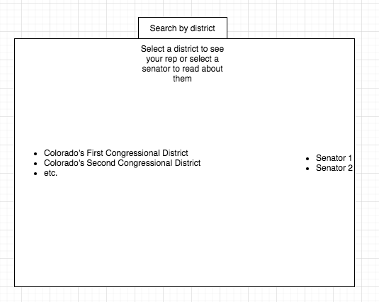
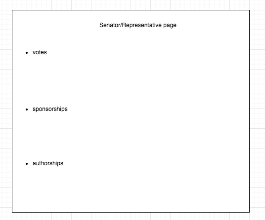
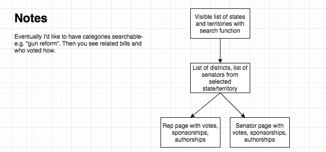

# P4 Pitch
- Name of app: Congress (placeholder)
- My name: Thomas Helderop
- New tech: Django for backend and frontend

## How do I plan on learning/implementing this new technology?
- YouTube Django tutorials
- Django documentation
- Prostrating myself before my god, Google, in hopes that it will, in its infinite knowledge, reveal the answers to my questions

## What is my goal with this project?
- First and foremost, passing the class.
- Secondly, and with much more excitement, laying the foundation for an idea I've thought about for a long time- before GA was even a twinkle in my eye.
- More practically, the goal is to sleekly and simply display what an American politician is doing: votes, authored bills, sponsored bills. Eventually, I'd love to implement some form of natural language processing to scan a bill and return a succinct summary of that bill, using everyday language rather than legislative jargon. Easy for everyone to understand.

## Who is the user for your app?
It varies from state to state and year to year, but generally speaking, about 50% of our voting-aged American brothers and sisters don't vote. Political disinterest is pervasive in our culture, and we can plainly see (and this was true before we elected a facist as our leader) the negative impact from a political structure without any significant democratic oversight.

So my app is for those Americans too busy to perform their democratic duties. Don't trust CNN or FOX? I don't blame you. Not internet-savvy enough to find reliable news sources online? My app will be a commentary-free one stop shop to find your elected officials and see what bills they've voted on, sponsored, and authored. Don't listen to Don Lemon, Tucker Carlson, Nancy Pelosi, or Mitch McConnell. Let the politicians' actions speak for themselves.

## Any potential roadblocks you think you might run into?
Technology, meet Thomas.

## Work Schedule
### Friday 8/14
- YouTube tutorials for Django
- Dive into Django documentation
- Build a basic database in Django as a test
- Begin work on models
### Saturday 8/15
- Finish models
- Begin frontend
- Plot the end of the world with my alien overlords
### Sunday 8/16
- Build out frontend
- Redesign models as needed
### Monday 8/17
- Squash any and all bugs
- Reach total functionality for proof-of-concept
### Tuesday 8/18
- Frontend styling
### Wednesday 8/19
- Today is just the cherry on top- expand the frontend as much as I can in the time available

## ERD (in-progress)

## Front end wireframe (basic version)

## User flow
